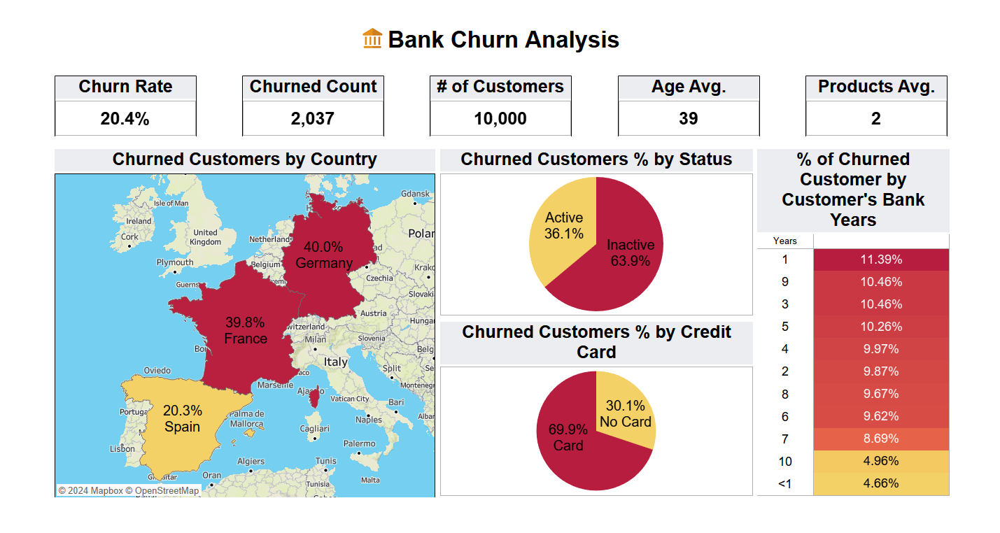
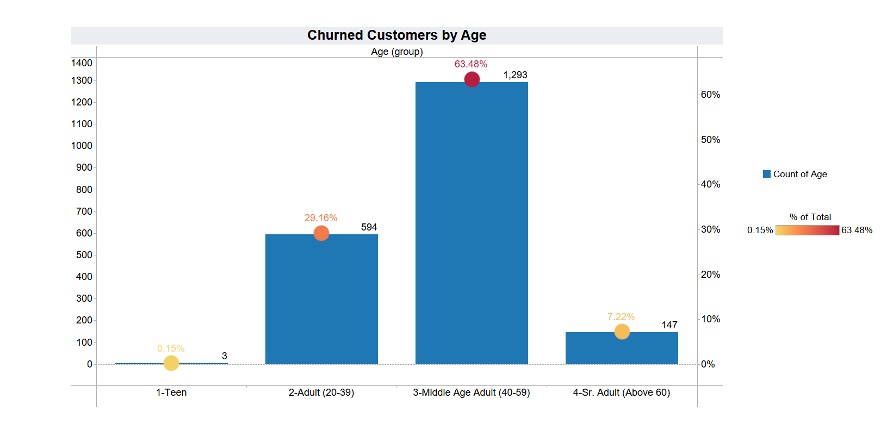
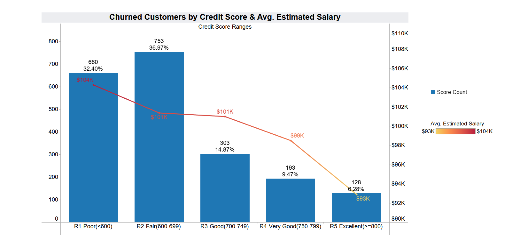

# Overview

Analyzing the behavior of customers who have left the bank to identify patterns and reasons for their departure.
The findings can then be applied to reduce attrition and improve customer retention in the future.

I am not in Banks field so I did a bit of a research & little digging on the subject of Bank Churn to identify the Churn Rate equation & how Banks calculate & categorize the credit scores.

For Data Source click here: [Data Source](/Source_Data/Bank+Customer+Churn.zip/)

For Tableau Public click here: [Tableau Public](https://public.tableau.com/views/BankChurn_17249682380290/BankChurnAnalysisOverview?:language=en-US&:sid=&:display_count=n&:origin=viz_share_link)

# Tools I Used

- **Tableau:** For Data Cleaning & Visualization.

# The Analysis

Focusing on the churned customers I made the below
### 1. Churn Count & Rate.
### 2. Churned Customers by Country.
### 3. Churned Customers by Activity.
### 4. Churned Customers by Owning a Credit Card.
### 5. Churned Customers by Membership Years.

### 6. Churned Customers by Age

Divided the customer's age to 4 groups (Teen, Adult, Middle Age & Seniors) for a clearer view.

### 7. Churned Customers by Score & Avg. Salary

Divided the customer's credit score to 5 groups (Poor, Fair, Good, Very Good & Excellent) for a clearer view.

# Insights

#### 1. Germany & France are having around 40% each from total churned customers while Spain is only 20%.
#### 2. 64% from the churned customers were inactive members. 
#### 3. 70% from the churned customers owned a Credit Card.
#### 4. Membership years doesn't impact churned rate much.
#### 5. Age group from 40 to 59 has the highest count with 63% from all the churned customers.
#### 6. Customers credit score "Fair" & "Poor" are the highest of churned customers by 37% & 32%.
#### 7. Remarkably the avg. salary tends to reverse with credit score ranges (Poor credit score range have the highest avg. salary)

# Recommendations

#### 1. Need to dig deeper into why the highest churn rate at Germany & France.
#### 2. Figuring a way of keeping track of the inactive customers to involve them more in the Bank's products & services.
#### 3. Making a survey for the churned customers who owned a credit card to see if there are any downsides from this service.
#### 4. Although the years doesn't impact much but need to reach those who have long membership years & high relatively churned rate like the 10% for the 9 years membership to assess their reason of leaving.
#### 5. Provide a retention plans specially for the age group from 40 to 59 & the "Fair" & "Poor" score ranges.
